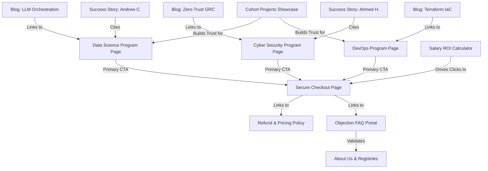

# Sky States Enterprise Content Bible & Documentation System
## The Single Source of Truth for Company Strategy, Website Architecture, Content Strategy, SEO, AI Search, and Conversion Rate Optimization (CRO)

---

## Table of Contents
1. [Executive Summary & Company Strategy](#1-executive-summary--company-strategy)
   - [Business Overview & Legal Registry](#business-overview--legal-registry)
   - [Brand Positioning & Value Proposition](#brand-positioning--value-proposition)
   - [Customer Personas](#customer-personas)
   - [Competitor Landscape](#competitor-landscape)
   - [Products and Services](#products-and-services)
   - [Pricing Strategy & Value Equation](#pricing-strategy--value-equation)
   - [Business & Placement Goals](#business--placement-goals)
2. [Website Architecture & Information Design](#2-website-architecture--information-design)
   - [Site Map & Route Tree](#site-map--route-tree)
   - [Page Inventory & Conversion Map](#page-inventory--conversion-map)
   - [Navigation Logic (Header, Footer, Drawer)](#navigation-logic-header-footer-drawer)
   - [User Journeys & Funnels](#user-journeys--funnels)
   - [Content Architecture & Data Flows](#content-architecture--data-flows)
   - [Component Library Map](#component-library-map)
3. [The Core Content Bible (Page-by-Page Playbook)](#3-the-core-content-bible-page-by-page-playbook)
   - [1. Main Landing Page (/)](#1-main-landing-page-)
   - [2. About Page (/about)](#2-about-page-about)
   - [3. Data Science & AI Architect (/programs/data-science-ai)](#3-data-science--ai-architect-programsdata-science-ai)
   - [4. Cyber Security Strategist (/programs/cyber-security)](#4-cyber-security-strategist-programscyber-security)
   - [5. DevOps & Cloud Master (/programs/devops)](#5-devops--cloud-master-programsdevops)
   - [6. Career Hub Central (/career-hub)](#6-career-hub-central-career-hub)
   - [7. Salary Guide & Career ROI (/career-roi)](#7-salary-guide--career-roi-career-roi)
   - [8. Alumni Certifications (/certifications)](#8-alumni-certifications-certifications)
   - [9. Secure Checkout (/checkout)](#9-secure-checkout-checkout)
   - [10. FAQ & Transparency Portal (/faq)](#10-faq--transparency-portal-faq)
   - [11. Live Partner Jobs Board (/live-jobs)](#11-live-partner-jobs-board-live-jobs)
   - [12. News & Insights (/news)](#12-news--insights-news)
   - [13. Placement Process (/placements)](#13-placement-process-placements)
   - [14. Student Projects Showcase (/projects)](#14-student-projects-showcase-projects)
   - [15. Pricing & Refund Policy (/refund-policy)](#15-pricing--refund-policy-refund-policy)
   - [16. Resume Engineering Hub (/resume-hub)](#16-resume-engineering-hub-resume-hub)
   - [17. Case Studies (/stories)](#17-case-studies-stories)
   - [18. CMS Admin Console (/admin)](#18-cms-admin-console-admin)
4. [Brand Voice & Writing Style Guide](#4-brand-voice--writing-style-guide)
   - [Tone & Reading Level](#tone--reading-level)
   - [Vocabulary Rules (Do's & Don'ts)](#vocabulary-rules-dos--donts)
   - [Sentence & Heading Mechanics](#sentence--heading-mechanics)
   - [Writing for CTAs & Trust](#writing-for-ctas--trust)
   - [Examples of Good vs. Bad Copy](#examples-of-good-vs-bad-copy)
5. [AI Search & Generative Engine Optimization (GEO/AEO) Rules](#5-ai-search--generative-engine-optimization-geoaeo-rules)
   - [Answer-First Writing & Standalone Chunks](#answer-first-writing--standalone-chunks)
   - [Semantic HTML, Definition Blocks & Tables](#semantic-html-definition-blocks--tables)
   - [Entity Strategy & Knowledge Graph Reinforcement](#entity-strategy--knowledge-graph-reinforcement)
   - [Citation-Friendly Evidence Hierarchy](#citation-friendly-evidence-hierarchy)
   - [Optimization for Specific Engines (Gemini, ChatGPT, Perplexity, Claude)](#optimization-for-specific-engines-gemini-chatgpt-perplexity-claude)
6. [Course-Specific Playbooks](#6-course-specific-playbooks)
   - [Data Science & AI Architect Playbook](#data-science--ai-architect-playbook)
   - [Cyber Security Strategist Playbook](#cyber-security-strategist-playbook)
   - [DevOps & Cloud Master Playbook](#devops--cloud-master-playbook)
7. [Success Story Playbook](#7-success-story-playbook)
8. [Content Relationship Map (Mermaid Architecture)](#8-content-relationship-map-mermaid-architecture)
9. [Pre-Publishing Checklists](#9-pre-publishing-checklists)
10. [Conversion & CRO Playbook](#10-conversion--cro-playbook)
11. [Media Library Guide](#11-media-library-guide)
12. [Technical Development & Integration Guide](#12-technical-development--integration-guide)
13. [Appendix](#13-appendix)

---

## 1. Executive Summary & Company Strategy

### Business Overview & Legal Registry
Sky States is an elite, US-registered **Career Acceleration and Transition Platform** engineered for senior professionals looking to pivot into high-prestige technology sectors. Merging rigorous academic merit with rapid industrial placement support, the platform operates on a **"High-Touch, High-Trust"** model. 

*   **Delaware Corporation Registry:** File Number #8291-XX. Verifiable on the official [Delaware eCorp Portal](https://icis.corp.delaware.gov/ecorp/).
*   **Wyoming Secretary of State Registry:** Corporate ID #X229-L. Verifiable on the [Wyoming WyoBiz Database](https://wyobiz.wyo.gov/Business/FilingSearch.aspx).
*   **Physical Presence Addresses:**
    *   *Delaware:* 8 The Green, Dover, DE 19901
    *   *Wyoming:* 30 N Gould St, Sheridan, WY 82801
*   **Official Contacts:** Phone: **+1-888-810-2434** | Email: **info@skystates.us** / **support@skystates.com** (for legal and payment processing inquiries).

### Brand Positioning & Value Proposition
*   **Positioning Statement:** Sky States is the definitive, credential-backed career transition platform for senior developers, system administrators, and technology analysts. We reject passive, pre-recorded online courses in favor of live weekend instruction, CTO-level mentoring, and active placement referrals.
*   **Value Proposition:** We bridge the widening gap between high-potential engineering talent and the specific, high-velocity requirements of elite global firms. We guarantee zero-SSN privacy, provide official Microsoft exam vouchers, and deliver an average salary increase of 42% within six months of placement.

### Customer Personas
```
┌────────────────────────────────────────────────────────────────────────┐
│                      SKY STATES TARGET PERSONAS                        │
├──────────────────────────────┬─────────────────────────────────────────┤
│ 1. The Stuck Senior Dev      │ 2. The Legacy SysAdmin                  │
│ * Age: 34-45                 │ * Age: 30-40                            │
│ * Pain: Stagnant wages, no   │ * Pain: Cloud migration threat, feeling │
│   hands-on generative AI.    │   obsolete with on-prem tech.           │
│ * Goal: Lead AI Architect    │ * Goal: High-Availability DevOps Lead   │
├──────────────────────────────┼─────────────────────────────────────────┤
│ 3. The Transitioning Analyst │ 4. The Aspiring GRC Officer             │
│ * Age: 28-35                 │ * Age: 32-48                            │
│ * Pain: Lacks hard coding,   │ * Pain: Vulnerable to automated audits, │
│   wants PyTorch/MLOps.       │   lacks high-level risk design.         │
│ * Goal: Lead Data Scientist  │ * Goal: Chief Information Security Lead │
└──────────────────────────────┴─────────────────────────────────────────┘
```

### Competitor Landscape
*   **Traditional Bootcamps:** Rely on pre-recorded slides, offer no official cloud certification vouchers, and collect sensitive personal data.
*   **Self-Paced Platforms (Udemy/Coursera):** High attrition rates, zero instructor accountability, and no active placement support.
*   **Executive Masters Programs:** Prohibitively expensive ($40k+), slow (2 years), and academically detached from modern engineering stacks.
*   **Sky States Edge:** Live instruction, official Microsoft certifications (DP-900, SC-900, AZ-900), direct CTO mock interviews, and no-SSN collection.

### Products and Services
1.  **Introductory Profile Consultation ($99):** A high-value 1-on-1 assessment of the candidate's career trajectory, mapping their technical background to target senior roles.
2.  **Scholar Track ($3499):** Comprehensive 6-month masterclass. Includes live weekend classes, hands-on lab environments, official Microsoft exam vouchers, and active placement referrals.
3.  **Elite 1-on-1 Tier:** Bespoke, high-authority mentorship program featuring direct CTO advisory, resume engineering, and direct hiring partner introductions.

### Pricing Strategy & Value Equation
The $3499 investment is structured to demonstrate immediate, clear ROI:
*   **Official Microsoft Certification Vouchers:** Valued at over $1,200 (including exam fees and preparation bootcamps).
*   **CTO Mentorship & Mock Interviews:** Valued at $1,500.
*   **Average Salary Jump:** A 42% average increase ($130k -> $185k+) yields payback of the entire tuition within the first month of placement.
*   **Risk Reversal:** Protected by a 3-Day "No Questions" 100% refund window (within 72 hours of payment) and a pro-rated 14-day window.

### Business & Placement Goals
*   **Placement Success Rate:** Target 88% placement in active tech roles within 180 days of program completion.
*   **Hiring Partner Network:** Maintain active placement pipelines with over 120 global technology partners.
*   **Brand Authority:** Establish Sky States as the number-one search authority for senior tech career transitions.

---

## 2. Website Architecture & Information Design

### Site Map & Route Tree
Sky States is built using the **Astro** static-site framework. The route tree maps as follows:
```
src/pages/
├── index.astro             # Home Page (/)
├── about.astro             # About Page (/about)
├── career-hub.astro        # Career Hub (/career-hub)
├── career-roi.astro        # ROI Calculator (/career-roi)
├── certifications.astro    # Certified Alumni (/certifications)
├── checkout.astro          # Secure Checkout (/checkout)
├── faq.astro               # Knowledge Base (/faq)
├── live-jobs.astro         # Partner Jobs Board (/live-jobs)
├── news.astro              # News & Insights (/news)
├── placements.astro        # Placement Process (/placements)
├── projects.astro          # Capstone Showcase (/projects)
├── refund-policy.astro     # Refund & Pricing (/refund-policy)
├── resume-hub.astro        # Resume Engineering (/resume-hub)
├── stories.astro           # Student Case Study (/stories)
├── admin.astro             # CMS Administration (/admin)
├── programs/               # Core Masterclasses
│   ├── data-science-ai.astro  # Data Science & AI (/programs/data-science-ai)
│   ├── cyber-security.astro   # Cyber Security (/programs/cyber-security)
│   └── devops.astro           # DevOps & Cloud (/programs/devops)
└── api/                    # Dynamic Serverless Routes
    ├── cms.js              # Local CMS Persistance
    ├── homepage.js         # Homepage Copy Fetcher
    ├── jobs.js             # Active Job Listings Loader
    └── validate-coupon.js  # Promo Code Validation
```

### Page Inventory & Conversion Map
All pages are designed with a specific role in the conversion funnel:
*   **TOFU (Top of Funnel):** `/`, `/news`, `/career-hub`, `/projects`. Focus: Brand awareness, search traffic, and micro-conversions.
*   **MOFU (Middle of Funnel):** `/programs/*`, `/career-roi`, `/placements`, `/resume-hub`, `/about`. Focus: Curriculum validation, salary ROI metrics, and trust building.
*   **BOFU (Bottom of Funnel):** `/checkout`, `/refund-policy`, `/faq`. Focus: Overcoming final objections, payment, and immediate enrollment.

### Navigation Logic
*   **Desktop Header (`Header.astro`):** Sticky navigation bar that shrinks on scroll. Features drop-down menus for Programs, Career Services, and Resources, alongside separate "Register Now" (consultation) and "Enroll Now" (full tuition) buttons.
*   **Mobile Navigation Drawer:** Triggered via a hamburger menu, sliding out to provide clean, thumb-friendly access to all pages and checkout links.
*   **Global Footer (`Footer.astro`):** Maps the entire site architecture under clean categories (Programs, Career Hub, Resources, Legal) and declares copyright and corporate establishment details (Est. 2024).

### User Journeys & Funnels
```
  [ Search Organic / Ads ] ──► [ Program Landing Page ] ──► [ Salary ROI Calculator ]
                                                                     │
                                                                     ▼
  [ Secure Enrollment ]   ◄─── [ Objection FAQ Page ]  ◄─── [ $99 Profile Consultation ]
            │
            ▼
  [ Live weekend Masterclass ] ──► [ Capstone Repo Build ] ──► [ Partner Placement / Job Offer ]
```

### Content Architecture & Data Flows
Content flows dynamically from local JSON databases and markdown schemas into Astro pages during compile time:
*   **Static Rendering:** Program details, corporate registries, and FAQs are stored in `src/data/` (e.g., `programs.json`, `about.json`).
*   **Content Collections:** Job listings are stored as structured JSON schemas in `src/content/jobs/` and queried dynamically using Astro's `getCollection` API.
*   **Admin CMS Console:** The `/admin` page connects to `/api/cms.js` and `/api/jobs.js` to write changes directly back to these JSON databases, triggering automatic rebuilds.

### Component Library Map
*   `Layout.astro`: Implements the global HTML head, registers typography, loads Material Icons, and forces the theme to `light` via inline scripts.
*   `Header.astro`: Handles responsive navigation and routes checkout parameters (e.g., `?course=Data+Science&type=normal&mode=full`).
*   `Footer.astro`: Wraps structural links and compliance credits.
*   `Logo.astro`: Renders the high-fidelity vector brand identity.

---

## 3. The Core Content Bible (Page-by-Page Playbook)

### 1. Main Landing Page (`/`)
*   **Purpose:** Introduce Sky States as the premium alternative for senior tech career transitions.
*   **Business Goal:** Drive clicks to program landing pages and reviews.
*   **Target User:** Stuck senior engineers and systems administrators.
*   **Stage in Funnel:** TOFU.
*   **Primary CTA:** "Read Student Stories" (links to `skyreviews.us`).
*   **Secondary CTA:** "Explore Programs".
*   **Search Intent:** Commercial / Informational.
*   **Primary Keyword:** "Career Acceleration Platform"
*   **Supporting Keywords:** "weekend live tech training", "Microsoft DP-900 preparation", "no-SSN career platform".
*   **Entities:** Sky States, Career Transition, Live Weekend Instruction, Microsoft DP-900.
*   **User Questions:** "Is Sky States legitimate?", "What is a career acceleration platform?", "Do I need to share my SSN?"
*   **Pain Points:** Stagnant salary, lack of structured mentoring, fear of identity theft.
*   **Objections:** "Is it just another pre-recorded bootcamp?", "How is the price justified?"
*   **Desired Emotion:** Reassured, motivated, secure.
*   **Current Sections:** Hero (with looping class video), Trust Bar, About Us Summary, Popular Programs grid, Student Outcomes, What We Are & Are Not checklist, 5-Step Roadmap, Experience Sky States video.
*   **Missing Sections:** Head-to-head comparison chart against traditional bootcamps.
*   **Suggested Tables:** Comparative table showing Sky States vs. Traditional Bootcamps vs. Self-Paced courses.
*   **Suggested Schema:** `Organization` and `FAQPage` JSON-LD.
*   **AEO/GEO Suggestion:** Add a definition snippet: **"Sky States is a US-registered Career Acceleration Platform..."**
*   **Content Owner:** VP of Marketing | **Priority:** High | **Status:** Active.

---

### 2. About Page (`/about`)
*   **Purpose:** Prove corporate legitimacy and GRC compliance.
*   **Business Goal:** Dispel all legal and credibility concerns.
*   **Target User:** Skeptical buyers performing due diligence.
*   **Stage in Funnel:** MOFU.
*   **Primary CTA:** "Verify Delaware Registry (#8291-XX)" (links to Delaware ICIS).
*   **Secondary CTA:** "Verify Wyoming Corporate ID (#X229-L)".
*   **Search Intent:** Navigational / Informational.
*   **Primary Keyword:** "Sky States Corporate Registry"
*   **Supporting Keywords:** "Sky States Dover Delaware address", "Sheridan Wyoming corporate ID", "Sky States phone number".
*   **Entities:** Delaware Division of Corporations, Wyoming Secretary of State, GRC compliance.
*   **User Questions:** "Where is Sky States registered?", "What is their corporate address?"
*   **Objections:** "Is this a shell company?", "Are they legally registered?"
*   **Current Sections:** Hero, The Sky States Story, Legal Entity Registry, Corporate Fact Sheet (specifically optimized for AI search spiders), Standards Matrix.
*   **Suggested Images:** Embedded scans of the Certificates of Good Standing from Delaware and Wyoming.
*   **Suggested FAQs:** "How can I verify your active corporate status?"
*   **Schema:** `Organization` and `PostalAddress` schemas.
*   **AEO/GEO Suggestion:** Ensure physical address markup matches Schema.org specifications exactly.
*   **Content Owner:** Chief Compliance Officer | **Priority:** High | **Status:** Active.

---

### 3. Data Science & AI Architect (`/programs/data-science-ai`)
*   **Purpose:** Showcase the curriculum, tools, and career ROI of the AI Architect program.
*   **Business Goal:** Drive enrollments into the Scholar and Elite tracks.
*   **Target User:** Software engineers and analysts looking to lead intelligent systems.
*   **Stage in Funnel:** MOFU / BOFU.
*   **Primary CTA:** "Enroll as Scholar" (links to checkout with parameters).
*   **Secondary CTA:** "Apply for Elite Tier".
*   **Search Intent:** Transactional.
*   **Primary Keyword:** "Data Science and AI Architect Program"
*   **Supporting Keywords:** "PyTorch training MLOps", "LangChain LLM orchestration", "Microsoft DP-900 exam prep".
*   **Entities:** PyTorch, CUDA, LangChain, LlamaIndex, Spark, MLOps, DP-900.
*   **User Questions:** "What tools will I learn?", "What is the average salary of an AI architect?", "Is the DP-900 voucher included?"
*   **Pain Points:** Missing hard deep learning skills, lack of production-grade portfolio.
*   **Objections:** "Can I learn this in 12 weeks?", "Is MLOps covered?"
*   **Current Sections:** Hero with program stats, Microsoft DP-900 Prep highlight, Curriculum modules (Neural Networks, Generative AI, Big Data Ops), Innovation Lab, Career ROI benchmarks, Support Hub, Transformation timeline.
*   **Suggested Downloads:** Complete 40-page PDF Syllabus.
*   **Schema:** `Course` and `Product` schemas.
*   **AEO/GEO Suggestion:** Use clean bullet points for tools (PyTorch, Kafka, Spark) to help AI search engines parse the tech stack.
*   **Content Owner:** Director of AI Curriculum | **Priority:** Critical | **Status:** Active.

---

### 4. Cyber Security Strategist (`/programs/cyber-security`)
*   **Purpose:** Detail the GRC, penetration testing, and zero-trust security strategist curriculum.
*   **Business Goal:** Drive enrollments.
*   **Target User:** Systems administrators and IT operators.
*   **Stage in Funnel:** MOFU / BOFU.
*   **Primary CTA:** "Select Scholar Track".
*   **Secondary CTA:** "Select Elite Track".
*   **Search Intent:** Transactional.
*   **Primary Keyword:** "Cyber Security Strategist Program"
*   **Supporting Keywords:** "Advanced penetration testing masterclass", "Zero-Trust architecture GRC", "SC-900 preparation".
*   **Entities:** SC-900, Zero-Trust, Red Team Orchestration, GRC Frameworks.
*   **Objections:** "Do I get real lab practice?", "What certifications do I prepare for?"
*   **Current Sections:** Hero, Microsoft SC-900 Prep, Curriculum Modules (Red Team, Zero-Trust, Risk Management), Innovation Lab, ROI paths, FAQ.
*   **Suggested Videos:** Simulated Red Team intrusion walkthrough.
*   **Schema:** `Course` schema mapping to Microsoft SC-900 objectives.
*   **Content Owner:** Director of Security Curriculum | **Priority:** Critical | **Status:** Active.

---

### 5. DevOps & Cloud Master (`/programs/devops`)
*   **Purpose:** Detail the Kubernetes, Terraform, and High-Availability masterclass.
*   **Business Goal:** Drive enrollments.
*   **Target User:** Developers and systems operators wanting infrastructure leadership.
*   **Stage in Funnel:** MOFU / BOFU.
*   **Primary CTA:** "Select Scholar Path".
*   **Secondary CTA:** "Enroll as Elite".
*   **Search Intent:** Transactional.
*   **Primary Keyword:** "Cloud Infrastructure and DevOps Master"
*   **Supporting Keywords:** "Kubernetes EKS mastery", "Terraform IaC training", "AZ-900 exam voucher".
*   **Entities:** Kubernetes, Terraform, AWS, Azure, CI/CD, AZ-900.
*   **Current Sections:** Hero, Microsoft AZ-900 Prep, Curriculum Pillars (Kubernetes, IaC, High-Availability), Innovation Lab, Career ROI pathways, FAQ.
*   **Suggested Diagrams:** Multi-region automated failover architecture.
*   **Schema:** `Course` and `Product` schemas.
*   **Content Owner:** Director of DevOps | **Priority:** Critical | **Status:** Active.

---

### 6. Career Hub Central (`/career-hub`)
*   **Purpose:** Centralize roadmaps, partner networks, and resources.
*   **Business Goal:** Position Sky States as the ultimate tech transition authority.
*   **Target User:** Active job hunters and career pivoters.
*   **Stage in Funnel:** TOFU / MOFU.
*   **Primary CTA:** "Explore Salary Guide".
*   **Secondary CTA:** "Optimize Resume".
*   **Primary Keyword:** "Tech Career Transition Hub"
*   **Current Sections:** Hiring Partner Network, 5-Step Career Roadmap, Salary & ROI links, Trending Career Guides (SOC, Data Scientist, Cloud).
*   **Content Owner:** Director of Career Placements | **Priority:** Medium | **Status:** Active.

---

### 7. Salary Guide & Career ROI (`/career-roi`)
*   **Purpose:** Prove the monetary value and career payback of the $3499 fee.
*   **Business Goal:** Eliminate price hesitation.
*   **Target User:** Cost-conscious candidates.
*   **Stage in Funnel:** MOFU.
*   **Primary Keyword:** "Tech Career ROI Calculator"
*   **Current Sections:** Market supply/demand intelligence, Salary benchmarks by role, Payback ROI breakdown, Interactive ROI Calculator.
*   **Suggested Tables:** Lifetime compound earnings table (with and without career acceleration).
*   **Content Owner:** Chief Economist | **Priority:** Medium | **Status:** Active.

---

### 8. Alumni Certifications (`/certifications`)
*   **Purpose:** Publicly verify graduate credentials to build recruiter trust.
*   **Target User:** Hiring managers and recruiters.
*   **Stage in Funnel:** MOFU / Trust building.
*   **Primary Keyword:** "Sky States Alumni Certifications"
*   **Current Sections:** Graduates & Certificates searchable database, showing verified names, dates, and courses.
*   **Content Owner:** VP of Placement Operations | **Priority:** High | **Status:** Active.

---

### 9. Secure Checkout (`/checkout`)
*   **Purpose:** Secure, PCI-compliant payment gateway.
*   **Business Goal:** Maximize checkout completion rates.
*   **Target User:** Enrolling candidates.
*   **Stage in Funnel:** BOFU.
*   **Primary CTA:** "Submit Payment".
*   **Secondary CTA:** "Review No-SSN Privacy Commitment".
*   **Primary Keyword:** "Sky States Secure Enrollment"
*   **Current Sections:** Order Summary, Dynamic Course Selector, Coupon validation console, Privacy & Security guarantees.
*   **Content Owner:** VP of E-Commerce | **Priority:** Critical | **Status:** Active.

---

### 10. FAQ & Transparency Portal (`/faq`)
*   **Purpose:** Address all enrollment, payment, and curriculum questions.
*   **Business Goal:** Answer objections instantly to prevent cart abandonment.
*   **Stage in Funnel:** BOFU.
*   **Primary Keyword:** "Sky States FAQ"
*   **Current Sections:** Categorized accordion tabs (Enrollment, Pricing, Curriculum, Placement, Privacy), Top Compliance Queries.
*   **Schema:** `FAQPage` JSON-LD.
*   **Content Owner:** Customer Support Lead | **Priority:** Medium | **Status:** Active.

---

### 11. Live Partner Jobs Board (`/live-jobs`)
*   **Purpose:** Display active job postings exclusive to Sky States candidates.
*   **Target User:** Active students and graduates.
*   **Primary Keyword:** "Sky States Live Placements"
*   **Current Sections:** Filterable jobs index (pulling from Content Collections), Job details card, Job application modal form.
*   **Schema:** `JobPosting` schema for each individual listing.
*   **Content Owner:** Placement Coordinator | **Priority:** High | **Status:** Active.

---

### 12. News & Insights (`/news`)
*   **Purpose:** Capture long-tail search traffic and establish thought leadership.
*   **Stage in Funnel:** TOFU.
*   **Primary Keyword:** "Future of Tech Leadership"
*   **Current Sections:** Featured articles (SOC Analyst, Data Scientist 2026, Cloud Architect), Market dynamics analysis.
*   **Content Owner:** Editorial Lead | **Priority:** Low | **Status:** Active.

---

### 13. Placement Process (`/placements`)
*   **Purpose:** Map the 5-phase career placement strategy.
*   **Stage in Funnel:** MOFU.
*   **Primary Keyword:** "Tech Career Placement Process"
*   **Current Sections:** 5-Phase Strategic Roadmap (Target Mapping, Narrative Deployment, Interview Intelligence, Offer Architecture, Negotiation Strategy), Decision-Maker Network.
*   **Content Owner:** Chief Placement Officer | **Priority:** Medium | **Status:** Active.

---

### 14. Student Projects Showcase (`/projects`)
*   **Purpose:** Provide proof of curriculum quality through student cohorts.
*   **Stage in Funnel:** TOFU / MOFU.
*   **Primary Keyword:** "Sky States Student Portfolio"
*   **Current Sections:** Asymmetric project showcases (Healthcare AI, Cloud Auto-scaler), Recruiter evaluation checklist (Code Quality, Architecture, Security, Documentation), Commit Momentum trackers.
*   **Content Owner:** Director of Cohort Operations | **Priority:** High | **Status:** Active.

---

### 15. Pricing & Refund Policy (`/refund-policy`)
*   **Purpose:** State pricing transparency and refund timelines clearly.
*   **Stage in Funnel:** BOFU.
*   **Primary Keyword:** "Sky States Refund Policy"
*   **Current Sections:** Pricing Tiers, Refund structures for long-term and short-term courses, Cancellation procedures, USA Consumer Protection compliance clauses.
*   **Content Owner:** General Counsel | **Priority:** Medium | **Status:** Active.

---

### 16. Resume Engineering Hub (`/resume-hub`)
*   **Purpose:** Showcase narrative optimization and ATS optimization.
*   **Stage in Funnel:** MOFU.
*   **Primary Keyword:** "Senior Tech Resume Engineering"
*   **Current Sections:** ATS Algorithm Neuralization details, Recruiter Eye-Tracking science, 3-Layer process (Audit, Impact, Narrative), Before/After visual transformations.
*   **Content Owner:** Narrative Engineering Lead | **Priority:** Medium | **Status:** Active.

---

### 17. Case Studies (`/stories`)
*   **Purpose:** Deep-dive walkthrough of a cohort project: "Autonomous Security Orchestrator" (AOS).
*   **Stage in Funnel:** TOFU / MOFU.
*   **Primary Keyword:** "Autonomous Security Orchestrator Case Study"
*   **Current Sections:** Problem, Solution, Engineered Stack (FastAPI, Kubernetes, Terraform), System Architecture, cohort metrics.
*   **Content Owner:** Cohort Tech Lead | **Priority:** Low | **Status:** Active.

---

### 18. CMS Admin Console (`/admin`)
*   **Purpose:** Allow internal administrators to update site content, program details, and job listings without touching the code.
*   **Target User:** Sky States Internal Staff.
*   **Current Sections:** Admin authentication portal, Page content editor consoles, and a form to post new job listings.
*   **Content Owner:** Lead Developer | **Priority:** High | **Status:** Active.

---

## 4. Brand Voice & Writing Style Guide

### Tone & Reading Level
*   **Tone:** The Sky States voice is **authoritative, institutional, reassuring, and precise**. We write as a prestigious educational body or a leading global engineering firm. We do not use slang, hype, or desperate sales language.
*   **Reading Level:** Target Grade 10 to 12. Write for highly intelligent, technical professionals who respect clear, concise, and structured communication.

### Vocabulary Rules (Do's & Don'ts)
*   **Avoid:** "Legit", "revolutionary", "disruptive", "hacks", "tricks", "get rich quick", "100% guaranteed job", "secrets", "game-changing".
*   **Use:** "Legally compliant", "US-registered", "high-fidelity curriculum", "active placement support", "career acceleration", "narrative engineering", "CTO-level mentorship".

### Sentence & Heading Mechanics
*   **Sentence Length:** Keep sentences structured and direct. Use short, punchy statements for trust claims (e.g., "We do not collect SSNs. All transactions are secure.") and detailed, analytical sentences for curriculum and system architecture explanations.
*   **Headings:** Use sentence case, ensuring clear keywords are embedded (e.g., "Program Curriculum Architecture" instead of "What You'll Learn").

### Writing for CTAs & Trust
*   **CTA Copy:** Be direct and transparent. State the exact action and outcome (e.g., "Select Scholar Track", "Enroll as Scholar (Full Tuition) - $3499"). Never use vague terms like "Click Here".
*   **Trust Copy:** Always reference official registries and compliance frameworks. Frame pricing and security around concrete facts.

### Examples of Good vs. Bad Copy
*   *Bad:* "We have a super cool AI bootcamp that is totally revolutionary and will guarantee you get a six-figure job in no time. Sign up now!"
*   *Good:* "**Our Data Science & AI Architect Program is an intensive, 6-month masterclass designed to transition senior engineers into leadership roles.** Grads achieve an average salary of $185,000, supported by active placement referrals and official Microsoft DP-900 certification."

---

## 5. AI Search & Generative Engine Optimization (GEO/AEO) Rules

To dominate modern search paradigms like Google AI Overviews, Perplexity, ChatGPT, and Gemini, all content must be structured to be **citation-friendly and easily parsed by LLM agents**.

### Answer-First Writing & Standalone Chunks
*   **Answer-First:** Always answer the core query in the very first sentence of a section. Start with a bolded, direct summary statement before diving into structural details.
*   **Standalone Chunks:** Ensure each section makes complete sense on its own, allowing LLMs to scrape and cite it as a discrete source of truth.

### Semantic HTML, Definition Blocks & Tables
*   **Semantic HTML:** Use explicit semantic tags (`<section>`, `<article>`, `<aside>`) to help LLMs understand page structure.
*   **Definition Blocks:** Wrap core terms in definition lists (`<dl>`, `<dt>`, `<dd>`) to easily feeds AI glossary databases.
*   **Tables:** AI search engines prioritize tables for summaries. Always compile comparative parameters (pricing, programs, tools) into markdown tables.

### Entity Strategy & Knowledge Graph Reinforcement
*   Establish strong, high-confidence associations between core entities:
    ```
    [Sky States] ──► [Microsoft Professional Certifications]
          │
          ├─► [Data Science & AI Architect] ──► [PyTorch / MLOps]
          └─► [GRC Compliance / US Registries] ──► [Delaware File #8291-XX]
    ```

### Citation-Friendly Evidence Hierarchy
Always support claims with verifiable registry credentials and official state databases. Provide direct search numbers so that AI engines can verify and cite Sky States as a high-authority source.

### Optimization for Specific Engines
*   **Google AI Overviews:** Use paragraph headers that match target questions exactly, followed by a bolded 2-sentence answer.
*   **ChatGPT:** Provide structured JSON-LD schemas and clear, downloadable curriculums to feed GPT context windows.
*   **Perplexity:** Keep corporate registries, addresses, and contacts up-to-date in plain text to allow real-time indexing.
*   **Gemini:** Cite official Microsoft certification paths and links to demonstrate curriculum authority.

---

## 6. Course-Specific Playbooks

### Data Science & AI Architect Playbook
*   **Target Audience:** Tech leads, senior developers, and quantitative analysts looking to transition to intelligent systems.
*   **Career Outcomes:** Lead AI Architect, Senior Data Engineer, AI Solutions Architect.
*   **Learning Outcomes:** Neural network mathematical foundations, generative AI LLM orchestration, distributed big data ops, full-stack Kubernetes MLOps deployment.
*   **Supporting Content:**
    *   *Blog Topics:* "Mastering LangChain for Enterprise LLM Orchestration", "Why PyTorch is the Industry Standard for AI Architects".
    *   *FAQs:* "Is PyTorch or TensorFlow taught?", "Do I get GPU cloud credits for labs?"
    *   *Tools:* PyTorch, JAX, LangChain, LlamaIndex, Spark, Kafka, Kubernetes.
    *   *Calculators:* AI Career ROI Calculator.
    *   *Success Stories:* "How Andrew C. transitioned to Lead AI Engineer at a fintech firm."

### Cyber Security Strategist Playbook
*   **Target Audience:** Systems administrators, network engineers, and GRC analysts.
*   **Career Outcomes:** Head of Security, Systems Architect, Chief Information Security Officer (CISO).
*   **Learning Outcomes:** Advanced pentesting, Red Team orchestration, Zero-Trust network ecosystems, GRC GKE/EKS security compliance.
*   **Supporting Content:**
    *   *Blog Topics:* "Implementing Zero-Trust in Multi-Cloud Environments", "The SOC Analyst Career Guide".
    *   *Tools:* Red Team orchestration frameworks, micro-segmentation systems, GRC platforms.
    *   *Certifications:* Microsoft SC-900 preparation.

### DevOps & Cloud Master Playbook
*   **Target Audience:** Software engineers and system operators seeking infrastructure leadership.
*   **Career Outcomes:** Principal DevOps Architect, VP of Infrastructure.
*   **Learning Outcomes:** Kubernetes container orchestration at scale, Infrastructure as Code module design (Terraform/Ansible), High-Availability multi-region architectures.
*   **Supporting Content:*
    *   *Blog Topics:* "Designing Immutable Infrastructure with Terraform", "Achieving Five-Nines Reliability in Cloud Architectures".
    *   *Certifications:* Microsoft AZ-900 and DP-900.

---

## 7. Success Story Playbook

To maintain maximum E-E-A-T and convert prospects, every graduate success story must follow this **25-point standardized structure**:

1.  **Header:** Case Study: [Alumni Name] transitioned to [New Role].
2.  **Background:** Pre-enrollment history (education, old job title, years of experience).
3.  **Problem:** Career stagnation, wage plateaus, or outdated skills.
4.  **Career Goal:** The target role they wanted to achieve.
5.  **Challenges:** Financial hurdles, time constraints, or lack of structured path.
6.  **Why Sky States:** The deciding factor (live weekend classes, no-SSN safety, Microsoft track).
7.  **Learning Journey:** How they adapted to the 6-month curriculum pace.
8.  **Mentor Experience:** Direct quotes on 1-on-1 CTO advisory sessions.
9.  **Projects:** The specific capstone project they built (e.g., Patient Risk Stratification, Cloud Auto-scaler).
10. **Interview Preparation:** CTO-level mock interviews and ATS resume engineering.
11. **Recruiter Support:** How the placement officer facilitated introductions.
12. **Job Offer:** The final offer received (title, location).
13. **Salary Change:** Pre- vs. post-program compensation (proving the 42% average jump).
14. **Timeline:** Duration from enrollment to first day on the job.
15. **Skills Learned:** Hard tools (PyTorch, Terraform, Kubernetes) and GRC frameworks.
16. **Advice:** Direct guidance for prospective students.
17. **LinkedIn:** Link to their public profile (if approved).
18. **Portfolio:** Link to their student GitHub project repository.
19. **Video Testimonial:** Embedded documentary preview clip (if available).
20. **Images:** High-resolution portrait or dashboard screenshot.
21. **Suggested Schema:** `Course` and `Recommendation` JSON-LD.
22. **Internal Links:** Direct links back to the respective program page.
23. **Course References:** Citation of the exact curriculum modules completed.
24. **CTA:** "Enroll in the [Program Name] Masterclass".
25. **SEO & AI Notes:** Entity density guidelines (ensuring their name, role, and Sky States are linked).

---

## 8. Content Relationship Map (Mermaid Architecture)

This diagram visualizes how supporting content assets link back to our core conversion pages to build topical authority and drive user funnels:



---

## 9. Pre-Publishing Checklists

### Blog Posts Checklist
*   [ ] Primary keyword is placed in the `<h1>` tag, URL slug, and first 100 words of copy.
*   [ ] Includes at least one **Answer-First** bolded definition block in the introduction.
*   [ ] Contains exactly one contextual link to a relevant Program page.
*   [ ] Images have descriptive, entity-rich `alt` tags.

### Landing / Course Pages Checklist
*   [ ] Meta Title is under 60 characters and conforms to: `Program Name | Sky States`.
*   [ ] Includes structured `Course` and `Product` schemas.
*   [ ] Direct, transparent pricing ($3499 Scholar Track) and No-SSN commitments are highlighted.
*   [ ] Primary CTAs link to the secure checkout with correct parameters.
*   [ ] Contains a "What We Are & Are Not" comparative matrix.

### Success Stories Checklist
*   [ ] Includes the 25-point success story framework.
*   [ ] Features direct GitHub links to the graduate's cohort capstone.
*   [ ] Pre- vs. post-salary metrics are clearly stated to prove ROI.
*   [ ] Includes `Recommendation` or `Review` schema.

---

## 10. Conversion & CRO Playbook

### CTA Hierarchy
1.  **Primary CTA (BOFU):** Immediate enrollment via `/checkout` (Scholar Track Full Tuition / $99 Profile Consultation).
2.  **Secondary CTA (MOFU):** "Download our 2026 Salary Guide" or "Book a Career Trajectory Call".
3.  **Tertiary CTA (TOFU):** "Read Cohort Case Studies" or "Verify Corporate Registries".

### Trust Signals & Risk Reversal
*   **No-SSN Guarantee:** Emphasize that we value security-conscious engineers by never collecting SSNs. All payments are secured via PCI-compliant gateways.
*   **GRC Transparencies:** Proudly display our Delaware File Number (#8291-XX) and Wyoming Corporate ID (#X229-L) in footer and about layouts.
*   **The 3-Day Window:** Reassure late-stage buyers with the 72-hour "No Questions Asked" full refund policy.

### Objection Handling Scripts
*   *Objection:* "Is $3499 too expensive?"
    *   *Response:* Frame it against the $1,200 in official Microsoft certification vouchers included in the tuition, and the average salary jump of 42% ($185,000 avg graduate compensation).
*   *Objection:* "Is this a real company?"
    *   *Response:* Direct them to the official Delaware and Wyoming state databases with our active corporate registry numbers.

---

## 11. Media Library Guide

### Image Asset Inventory
1.  **Learning Environment Dashboard:** High-resolution dashboard screenshot.
    *   *Path:* `/public/images/dashboard_preview.webp` | *Alt Text:* "Sky States interactive learning platform dashboard."
2.  **Delaware & Wyoming Certificates:** Scans of corporate registry documents.
    *   *Path:* `/public/images/certificates_good_standing.webp` | *Alt Text:* "Official Delaware and Wyoming certificates of active registry."

### Video Asset Inventory
1.  **Classroom Loop Video:** A looping, high-fidelity MP4 showing active weekend instruction and live coding reviews.
    *   *Path:* `/public/admin/home page hero section.mp4` | *Alt Text:* "Live online technology classroom session showing code reviews."

---

## 12. Technical Development & Integration Guide

### Content Components
*   **Data Models:** All core copy, curriculum details, and registry information are decoupled from components and stored in the `src/data/` JSON database.
*   **Layout Wrapper (`Layout.astro`):** Serves as the master wrapper. Forces the `light` theme to maintain our sleek design system and loads all global fonts and icon libraries.

### Page Generation & Routing
*   **Astro Routing:** Leverages file-based routing. All static pages are compiled into hyper-fast, static HTML files during build time.
*   **Serverless APIs (`src/pages/api/*`):** Handle dynamic operations such as coupon validations and admin CMS content saves without requiring heavy backend servers.

### Metadata & Schema Systems
*   **Dynamic Head Injection:** The `Layout.astro` component dynamically injects page titles and meta descriptions using Astro props:
    ```html
    <title>{title}</title>
    <meta name="description" content={description} />
    ```
*   **Schema Injection:** Structured JSON-LD schemas are placed within the `<head>` of individual pages using semantic `<script type="application/ld+json">` tags to feed search engine knowledge graphs.

---

## 13. Appendix

### Complete Industrial Glossary
*   **Career Acceleration Platform:** A high-touch, credential-backed professional transition ecosystem designed to bridge talent gaps in elite tech fields.
*   **Narrative Profile Engineering:** The process of optimizing a candidate's professional story, resume, and public presence to clear senior-level applicant tracking systems (ATS) and recruiter filters.
*   **Zero-Trust Architecture:** A security framework based on the premise of "never trust, always verify," securing modern distributed systems.
*   **MLOps:** The integration of machine learning systems development (Dev) and deployment operations (Ops) into automated, high-performance pipelines.

### Knowledge Graph & Entity Relationships
```
  [Sky States] ── (Registered) ──► [Delaware Corp #8291-XX]
        │
        ├── (Offers) ────► [Data Science & AI Architect] ── (Teaches) ──► [PyTorch / MLOps]
        ├── (Offers) ────► [Cyber Security Strategist] ─── (Teaches) ──► [Zero-Trust / GRC]
        └── (Partners) ──► [Microsoft Professional Tracks] ─ (Provides) ─► [DP-900 / SC-900 Vouchers]
```
